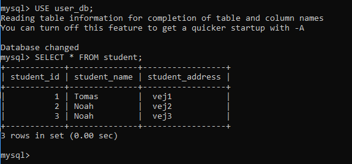
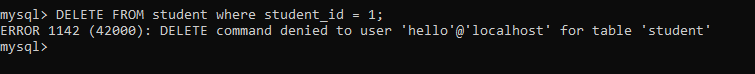
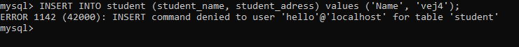
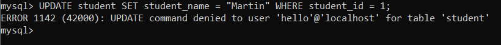
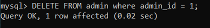
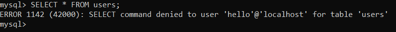
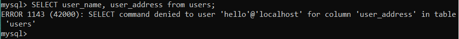
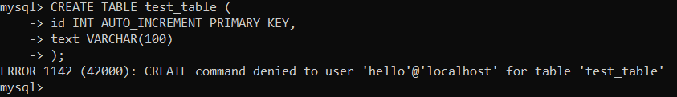

# Integrating https://github.com/RenasAli/Database-granular-access

## Student table

### Selecting students

Works as documented.

### Deleting a student

Also works as expected; receiving a permission denied error.

### Inserting a student

Also gives a permission denied error.

## Updating a student
¨

Also not allowed.

## Admin table

### Deleting an admin

Works as advertised.

## User table

### Selecting users

Also works as advertised - not allowed to select everything from this table

### Selecting only user_name and user_address

Does not work as advertised. Should be possible to select these.

### Creating a table

Was not mentioned in the documentation, but it is not allowed as well.

