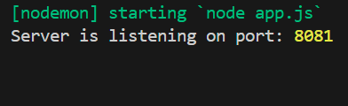

## Integrating with https://github.com/RenasAli/05a_expose_webhook_system

## Registering

Works as expected, but you have to define your own webhook events when registering.

## Pinging

Pings the registered endpoint but never returns a response, so postman or any other tool used to make the ping request will hang indefinitely unless a timeout is set.

The ping request body recieved by the server registering the webhook is seen below.

## Unregister

Works as expected. No payload is received when pinging after unregistering.

