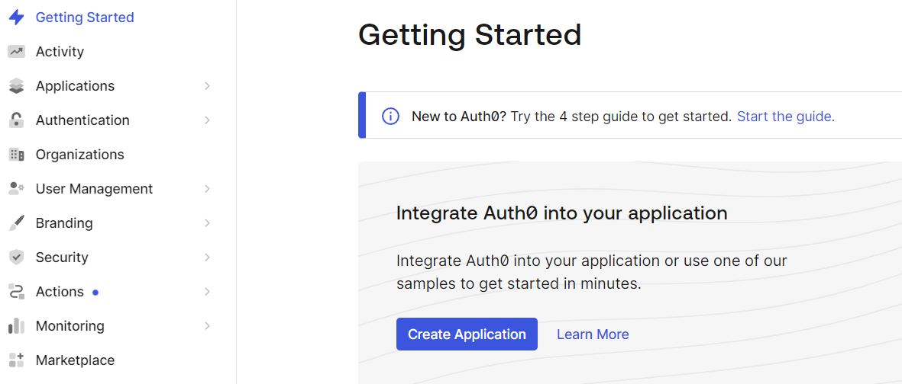
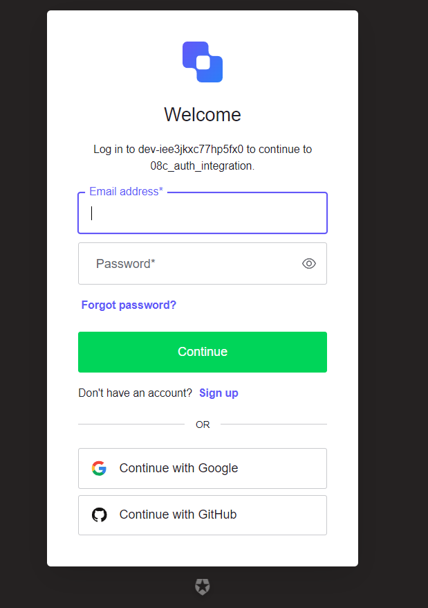

## Guide to set up identity management with Auth0

### Requirements
Have Node.js and npm installed.

### Create Auth0 account

Start by creating an Auth0 account by going to https://auth0.com/.

### Create application

After you have signed up, sign in and go to your dashboard https://manage.auth0.com/dashboard/.

Click **Create Application**. If you don't see the **"Create Application"** button, go to **"Getting Started"** in the sidebar to the left first.



Choose a name for your application and choose what kind of app you want to integrate auth0 with. This guide will be for **"Single Page Web Applications"** using **React**.

Click on **"React"** and you will be directed to a guide on how to set up authentication with the **Auth0 React SDK**.

### Create a React application

If you don't have the create-react-app package already, install it by running
``npm install -g create-react-app``.

After installing the the create-react-app package, create your react app by running
``npx create-react-app <app_name>``.

### Setting up login and signup with Auth0

Go back to the guide and find your application in the sidebar (the applicaton has the name that you chose earlier). Click on **Settings** and copy the Client ID and Domain, which we will need soon.

While on this page, scroll down and set **Allowed Callback URLs**, **Allowed Logout URLs** and **Allowed Web Origins** to ``http://localhost:3000``, which is the default port that our React app will run on. Remember to click **Save Changes**.

Now install the **Auth0 React SDK** by running ``npm install @auth0/auth0-react`` in a shell inside your React project folder.

Next step is to find your ``index.js`` file inside the ``src`` folder and make it look like this and provide the domain and client id that you copied earlier.

```
import React from 'react';
import { createRoot } from 'react-dom/client';
import { Auth0Provider } from '@auth0/auth0-react';
import App from './App';

const root = createRoot(document.getElementById('root'));

root.render(
<Auth0Provider
    domain="<your_domain>"
    clientId="<your_client_id>"
    authorizationParams={{
      redirect_uri: window.location.origin
    }}
  >
    <App />
  </Auth0Provider>,
);
```

Next, create a component called ``LoginButton.js`` inside the ``components`` folder and copy paste the following into it
```
import React from "react";
import { useAuth0 } from "@auth0/auth0-react";

const LoginButton = () => {
  const { loginWithRedirect } = useAuth0();

  return <button onClick={() => loginWithRedirect()}>Log In</button>;
};

export default LoginButton;
```

Now, import and use your LoginButton component inside the ``App.js`` file like below.

```
import LoginButton from './components/LoginButton';

function App() {
  return (
    <div className="App">
      <LoginButton></LoginButton>
    </div>
  );
}

export default App;

```

Start the app by running ``npm start``, and confirm that pressing the **log in** button takes you to a site hosted by Auth0 that looks like the below image.



Now, you should be able to sign up using either **Google**, **Github** or by just using your email and a password that you choose.

### Access and show logged in user information

To be able to access some details about your logged in user account, create a ``Profile.js`` component inside the ``components`` folder that looks like this.

```
import React from "react";
import { useAuth0 } from "@auth0/auth0-react";

const Profile = () => {
  const { user, isAuthenticated, isLoading } = useAuth0();

  if (isLoading) {
    return <div>Loading ...</div>;
  }

  return (
    isAuthenticated && (
      <div>
        
        <h2>{user.name}</h2>
        <p>{user.email}</p>
      </div>
    )
  );
};

export default Profile;
```

Import it into your ``App.js`` file and use it. Your ``App.js`` file should now look like this.

```
import LoginButton from './components/LoginButton';
import Profile from './components/Profile';

function App() {
  return (
    <div className="App">
      <LoginButton></LoginButton>
      <Profile></Profile>
    </div>
  );
}

export default App;
```

Having done that, you should be able to see a picture and your email when you log in.

### Implementing logout

Add a ``LogoutButton.js`` component to your ``components`` folder and put the following in it.

```
import React from "react";
import { useAuth0 } from "@auth0/auth0-react";

const LogoutButton = () => {
  const { logout } = useAuth0();

  return (
    <button onClick={() => logout({ logoutParams: { returnTo: window.location.origin } })}>
      Log Out
    </button>
  );
};

export default LogoutButton;
```

After creating the component, import and use it in your ``App.js`` file. I have adjusted the code a bit, so that the login button only shows when you are not logged in, and so that the logout button and user information are only shown when you are logged in. The final version of the ``App.js`` file is shown below.

```
import LoginButton from './components/LoginButton';
import LogoutButton from './components/LogoutButton';
import Profile from './components/Profile';
import { useAuth0 } from "@auth0/auth0-react";

function App() {
  const { isAuthenticated } = useAuth0();

  return (
    <div className="App">
      {isAuthenticated ? (
      <>
        <LogoutButton></LogoutButton>
        <Profile></Profile>
      </>
      ) :
      <LoginButton></LoginButton>   
      }
    </div>
  );
}

export default App;
```


